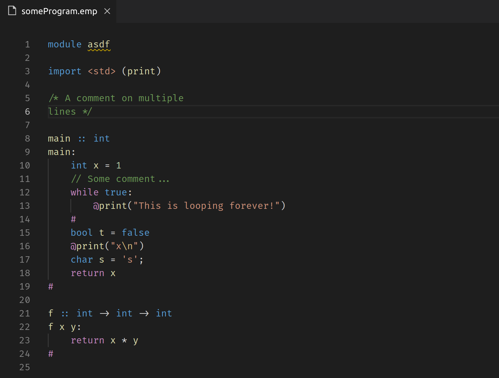

# Emperor Language Support

This extension provides syntax highlighting for the Emperor language.

## Features

An example of syntax highlighting is seen below.

## Requirements

This extension has no requirements.

## Extension Settings

This extension does contribute any settings.

## Known Issues

There are no known issues at the time of writing, but if you find any, please file them [here](https://github.com/emperor-lang/emperor-language-support/issues).

## Release Notes

Users appreciate release notes as you update your extension.

### 1.0.0

Initial release of Emperor Language Support
